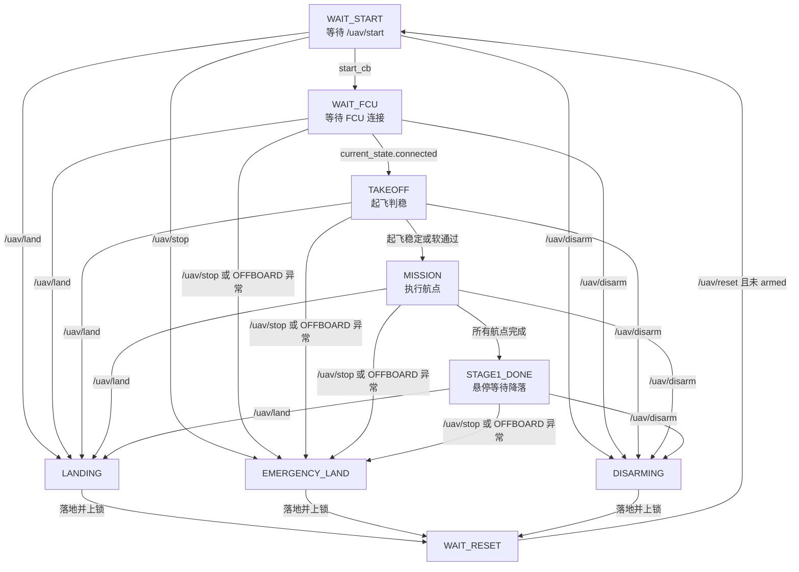
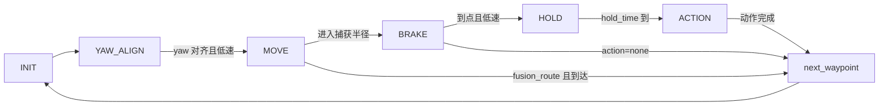

# FSM 状态机程序详解

本文档用于帮助全面读懂 `scripts/micro_uav_stage1_fsm.py` 的工作逻辑、状态流转、重要变量、ROS 接口、视觉对接和 YAML 任务配置。

阅读范围：

- 主程序：`scripts/micro_uav_stage1_fsm.py`
- 任务配置：`config/stage1_mission.yaml`
- 启动文件：`launch/stage1_sitl_test.launch`
- 远程控制辅助：`test/udp_uav_cmd_receiver.py`、`simple_ground_station_udp.py`
- 视觉接口补充：`FSM 与视觉节点任务对接文档.md`

## 1. 程序总体目标

这个节点是微型无人机第一阶段任务的主 FSM。它负责从 YAML 读取任务航点，然后按顺序完成：

1. 等待地面站启动命令。
2. 等待飞控连接，持续发布起飞 setpoint。
3. 自动或手动进入 OFFBOARD、解锁。
4. 起飞到安全高度并判稳。
5. 依次执行二维码扫描、绕障、图片靶识别投放、特殊靶投放、圆环搜索和穿越、回降落区。
6. 第一阶段结束后悬停等待降落命令。
7. 任何时候响应 `stop/land/disarm/reset` 等安全控制。

程序的核心特点：

- 外层 FSM 管任务生命周期和安全状态。
- 内层导航相位管单个航点的到达、刹停、悬停和动作。
- 远距离移动主要用速度 setpoint，接近目标后切换到位置锁点刹停，减少冲过头。
- 图片靶、特殊靶和圆环依赖视觉节点输出的米制偏差，不直接用像素误差控制飞机。
- 降落或急停之后强制进入 `WAIT_RESET`，防止旧任务在再次解锁后自动恢复。

## 2. 文件结构与入口

主文件结构如下：

| 区域 | 主要内容 |
|---|---|
| `Waypoint` 数据类 | 保存一个航点的名称、类型、坐标、速度、动作等配置 |
| 数学工具函数 | `norm3`、`clamp`、`wrap_pi`、速度向量限幅 |
| `MicroUAVStage1FSM.__init__` | 初始化 ROS 节点、读取 YAML、初始化变量、建立 pub/sub/service |
| YAML 读取区 | `load_yaml`、`parse_waypoints` |
| ROS 回调区 | 飞控状态、位姿、速度、二维码、视觉结果、安全控制命令 |
| MAVROS 指令发布区 | 发布速度、位置 + 速度融合、纯位置 setpoint |
| FSM 工具函数区 | 坐标转换、状态切换、判稳、发布状态、安全流程 |
| 起飞控制区 | 起飞到目标高度并判稳 |
| 航点导航控制区 | 每个航点内部的 `INIT/YAW_ALIGN/MOVE/BRAKE/HOLD/ACTION` |
| 动作执行区 | 二维码、图片靶、特殊靶、圆环搜索、圆环二次对准、任务结束 |
| 主循环区 | 按当前 `fsm_state` 调度对应逻辑 |

程序入口很简单：

```python
if __name__ == "__main__":
    node = MicroUAVStage1FSM()
    node.spin()
```

也就是说，真正的逻辑都在 `MicroUAVStage1FSM` 这个类里。

## 3. 双层状态机概念

这份代码不是只有一个状态变量，而是两层状态机叠加：

- `fsm_state`：外层任务状态，决定当前处于等待、起飞、任务、降落、复位等大阶段。
- `nav_phase`：内层航点状态，只有在 `fsm_state == "MISSION"` 时主要发挥作用，决定当前航点内部是转向、移动、刹车、悬停还是执行动作。

### 3.1 外层 FSM 状态

主要 `fsm_state`：

| 状态 | 含义 |
|---|---|
| `WAIT_START` | 节点启动后的默认状态，等待 `/uav/start=True` |
| `WAIT_FCU` | 已收到启动命令，等待飞控连接，同时持续发布起飞 setpoint |
| `TAKEOFF` | 执行起飞，达到高度、位置、速度、加速度条件后进入任务 |
| `MISSION` | 正式按航点列表执行任务 |
| `STAGE1_DONE` | 第一阶段航线结束，保持在最后一个航点，等待降落 |
| `LANDING` | 普通降落流程 |
| `EMERGENCY_LAND` | 急停降落流程 |
| `DISARMING` | 安全上锁流程，空中会先降落，落地后上锁 |
| `WAIT_RESET` | 安全保护状态，必须收到 reset 且无人机已上锁才回到 `WAIT_START` |

外层状态流转图：



### 3.2 内层航点状态 `nav_phase`

每个航点都会经过一套内部流程：

| 相位 | 含义 |
|---|---|
| `INIT` | 初始化当前航点，设置 `locked_yaw`，切到 `YAW_ALIGN` |
| `YAW_ALIGN` | 原地对齐目标 yaw，同时等待速度足够低 |
| `MOVE` | 向目标航点移动 |
| `BRAKE` | 进入捕获半径后锁定目标位置并给 0 速度，等待真实停稳 |
| `HOLD` | 到点后按 `hold_time` 短暂停留 |
| `ACTION` | 执行该航点动作，比如扫码、投放、圆环搜索 |

内层流转图：



注意：`fusion_route` 常用于圆环中心和后点，它默认不强制刹停，适合连续通过。

## 4. ROS 接口总览

### 4.1 发布的话题

| 话题 | 类型 | 作用 |
|---|---|---|
| `/mavros/setpoint_raw/local` | `mavros_msgs/PositionTarget` | 给 PX4/MAVROS 发布位置、速度和 yaw 控制 setpoint |
| `/uav/fsm_state` | `std_msgs/String` | 发布当前 FSM 状态，包含安全状态、降落状态、航点相位和航点名 |
| `/uav/safety_state` | `std_msgs/String` | 发布安全状态，如 `IDLE`、`EMERGENCY_LAND`、`WAIT_RESET_FORCED` |
| `/uav/land_status` | `std_msgs/String` | 发布降落和上锁流程状态 |
| `/uav/scan_enable` | `std_msgs/Bool` | 通知视觉节点是否启用识别 |
| `/uav/scan_target` | `std_msgs/String` | 通知视觉节点当前识别目标，如 `qr`、`image_target`、`special_target`、`ring_gate` |
| `/uav/drop_cmd` | `std_msgs/String` | 发送投放命令，如 `image_drop_1`、`image_drop_2`、`special_drop` |

### 4.2 订阅的话题

| 话题 | 类型 | 作用 |
|---|---|---|
| `/mavros/state` | `mavros_msgs/State` | 获取飞控连接、模式、解锁状态 |
| `/mavros/extended_state` | `mavros_msgs/ExtendedState` | 获取 landed state，用于确认是否落地 |
| `/mavros/local_position/pose` | `geometry_msgs/PoseStamped` | 获取 local 坐标和当前 yaw |
| `/mavros/local_position/velocity_local` | `geometry_msgs/TwistStamped` | 获取速度，并估算加速度 |
| `/uav/qr_text` | `std_msgs/String` | 接收二维码识别结果，格式示例 `man,apple,left` |
| `/uav/image_class` | `std_msgs/String` | 兼容旧逻辑，接收当前图片类别 |
| `/uav/vision_result` | `std_msgs/String` | 接收统一 JSON 视觉结果 |
| `/uav/start` | `std_msgs/Bool` | 启动任务 |
| `/uav/stop` | `std_msgs/Bool` | 急停降落 |
| `/uav/land` | `std_msgs/Bool` | 普通降落 |
| `/uav/disarm` | `std_msgs/Bool` | 安全上锁，空中会先降落 |
| `/uav/reset` | `std_msgs/Bool` | 复位 FSM，需要无人机已上锁 |

### 4.3 使用的 MAVROS 服务

| 服务 | 类型 | 作用 |
|---|---|---|
| `/mavros/cmd/arming` | `mavros_msgs/CommandBool` | 解锁或上锁 |
| `/mavros/set_mode` | `mavros_msgs/SetMode` | 切换 `OFFBOARD` 或 `AUTO.LAND` |

## 5. 重要数据结构

### 5.1 `Waypoint`

`Waypoint` 是从 YAML 里解析出来的航点结构。

| 字段 | 作用 |
|---|---|
| `name` | 航点名，例如 `QR_SCAN`、`IMG2_DROP`、`RING_PRE` |
| `kind` | 航点类型，只有 `route` 和 `scan` 两类 |
| `action` | 到点并停稳后执行的动作 |
| `x/y/z` | 航点坐标。当前 YAML 使用相对起飞点坐标 |
| `yaw_deg` | 目标 yaw，单位是度 |
| `speed` | 该航点移动阶段的最大目标速度 |
| `acc` | 每帧速度指令变化上限，控制加减速平滑性 |
| `hold_time` | 到点后进入 `ACTION` 前或动作完成前的保持时间 |
| `control_mode` | 控制模式，`position`、`fusion`、`fusion_route` |
| `dynamic_land` | 是否用二维码解析出的 left/right 动态替换降落点 |

`yaw_rad()` 会把 `yaw_deg` 转为弧度，供 setpoint 使用。

### 5.2 `control_mode` 的实际含义

| 模式 | 典型用途 | 实际控制逻辑 |
|---|---|---|
| `position` | 普通路线点、绕障点、回航点 | 远处用速度靠近，进入捕获半径后位置锁点刹停 |
| `fusion` | 需要精确停稳的 scan/drop 点 | 远处用速度靠近，进入捕获半径后位置锁点，停稳后执行动作 |
| `fusion_route` | 圆环中心和后点等连续通过点 | 主要用速度连续通过，到达误差范围后直接切下个航点 |

这里的名字保留了历史含义。当前代码在 MOVE 阶段尽量避免直接发布“最终位置 + 速度前馈”，而是远处只发速度，近处再锁点。

## 6. 初始化逻辑

`__init__` 主要做这些事：

1. `rospy.init_node("micro_uav_stage1_fsm")`
2. 从参数 `~mission_yaml` 读取 YAML 路径，默认路径是 `~/catkin_ws/src/uav_inventory/config/stage1_mission.yaml`
3. 读取任务配置和控制参数。
4. 解析 `waypoints` 为 `Waypoint` 列表。
5. 初始化控制阈值、起飞参数、视觉对准参数、圆环参数。
6. 初始化飞控状态、位姿、速度、home 原点、FSM 状态、动作缓存。
7. 创建 ROS publisher、subscriber 和 MAVROS service proxy。
8. 发布初始 `land_status=IDLE`、`safety_state=IDLE`。

启动文件 `launch/stage1_sitl_test.launch` 会给 FSM 传入：

```xml
<param name="mission_yaml" value="$(arg mission_yaml)" />
<param name="auto_set_mode" value="$(arg auto_set_mode)" />
<param name="auto_arm" value="$(arg auto_arm)" />
```

其中 SITL 默认：

- `auto_set_mode=true`
- `auto_arm=true`

实机时如果不希望程序自动切 OFFBOARD 或自动解锁，可以把它们设为 `false`，由人工或地面站完成。

## 7. 坐标系与 home 原点

`pose_cb` 第一次收到 `/mavros/local_position/pose` 时，会把当前 local 坐标保存为 home：

- `home_x`
- `home_y`
- `home_z`
- `home_yaw`
- `home_ready=True`

YAML 中 `mission.frame` 当前是 `relative_home`。在 `get_abs_wp()` 中，航点转换为：

```text
abs_x = home_x + wp.x
abs_y = home_y + wp.y
abs_z = home_z + wp.z
yaw   = wp.yaw_rad()
```

注意：代码没有用 `home_yaw` 对 x/y 做旋转。也就是说，YAML 的 x/y 是 MAVROS local 坐标轴上的相对偏移，不是“机头方向坐标系”。

## 8. 主循环 `spin()`

主循环频率由 `rate_hz` 控制，当前 YAML 是 30 Hz。

每一轮循环做这些事：

1. 计算 `dt`，并限制在 0.01 到 0.1 秒之间。
2. 发布 `/uav/fsm_state`。
3. 安全状态优先处理：
   - `EMERGENCY_LAND`
   - `LANDING`
   - `DISARMING`
4. 如果是 `WAIT_RESET`，关闭识别输出，发布零速度，等待 reset。
5. 如果还没有位姿或 home 原点，继续等待。
6. 按 `fsm_state` 调用对应逻辑：
   - `WAIT_START`：发布零速度，等待 start。
   - `WAIT_FCU`：尝试 OFFBOARD/ARM，发布起飞点 setpoint，飞控 connected 后进入 `TAKEOFF`。
   - `TAKEOFF`：继续尝试 OFFBOARD/ARM，执行起飞判稳。
   - `MISSION`：继续尝试 OFFBOARD/ARM，处理当前航点。
   - `STAGE1_DONE`：保持最后航点，等待降落。

## 9. 起飞逻辑

`process_takeoff()` 的目标点是：

```text
target_x = home_x
target_y = home_y
target_z = home_z + takeoff_height
target_yaw = takeoff_yaw_deg
```

每轮发布位置 + 0 速度 + yaw：

```python
publish_position_velocity_yaw(target_x, target_y, target_z, 0, 0, 0, target_yaw)
```

起飞判稳分两类：

### 9.1 严格判稳

必须同时满足：

- 当前高度 `height >= takeoff_min_height`
- 三维位置误差 `pos_err < takeoff_pos_eps`
- 当前速度 `current_speed < takeoff_stable_vel`
- 当前加速度估计 `current_acc_norm < takeoff_stable_acc`

连续满足超过 `takeoff_stable_time` 后进入 `MISSION`。

### 9.2 软通过

如果严格判稳迟迟不过，超过 `takeoff_max_wait` 后，只要满足更宽松条件也可以进入任务：

- 高度安全
- xy 误差不过大
- z 误差不过大
- 速度足够低

这个设计是为实机噪声准备的，避免起飞阶段被速度差分得到的假加速度长期卡住。

## 10. 航点导航逻辑

`process_current_waypoint(dt)` 是任务航线的核心函数。

它先根据 `wp_index` 找当前航点，再用 `get_abs_wp()` 得到绝对目标点：

- `tx/ty/tz`
- `target_yaw`
- 当前位姿 `cx/cy/cz`
- 误差 `dx/dy/dz/dist`

### 10.1 `INIT`

每个航点开始时：

- 把 `locked_yaw` 设置为 YAML 中的 `yaw_deg`
- 切到 `YAW_ALIGN`

代码注释里明确取消了“默认朝向目标点或运动方向”的策略。所有航点统一使用 YAML 配置 yaw，避免绕障、圆环等过程频繁转头。

### 10.2 `YAW_ALIGN`

该阶段发布零速度 + `locked_yaw`：

```python
publish_velocity_yaw(0.0, 0.0, 0.0, locked_yaw)
```

通过条件：

- yaw 误差小于 `yaw_eps`
- 并且速度足够低

如果速度/加速度轻微抖动，也有软通过：

- yaw 已经对齐
- 等待超过 `yaw_align_soft_wait`
- 速度低于 `yaw_align_soft_vel`

### 10.3 `MOVE`

如果 yaw 偏差突然大于 `yaw_break_eps`，会退回 `YAW_ALIGN`。

否则按 `control_mode` 分发：

- `position` -> `process_route_move()`
- `fusion_route` -> `process_fusion_route_move()`
- `fusion` -> `process_scan_move()`

三种 MOVE 都会调用 `publish_velocity_approach()` 计算平滑速度：

1. 距离大于 `slow_radius`：按 `wp.speed` 飞。
2. 距离小于 `slow_radius`：速度按距离线性降低。
3. 距离进入 `arrive_eps`：目标速度变为 0。
4. 用 `wp.acc * dt` 限制速度指令变化。
5. 发布 velocity + yaw，不发布最终 position。

### 10.4 `BRAKE`

进入捕获半径后，切到 `BRAKE`。该阶段发布：

```python
publish_position_velocity_yaw(tx, ty, tz, 0, 0, 0, locked_yaw)
```

也就是锁定目标位置，同时速度给 0。

通过条件：

- 位置误差小于 `arrive_eps`
- 当前速度低于对应阈值
- scan/fusion 点可选启用加速度门槛

如果是普通路线点，为防止卡死，还有软通过：

- action 为 `none`
- 刹停等待超过 `brake_timeout`
- 距离接近目标
- 当前速度小于 `brake_soft_vel`

若当前航点没有动作，则直接 `next_waypoint()`；若有动作，则进入 `HOLD`。

### 10.5 `HOLD`

持续锁定当前航点，等待 `wp.hold_time`。时间到后进入 `ACTION`。

### 10.6 `ACTION`

`process_action()` 会根据 `wp.action` 分发到具体动作函数。

动作开始时会初始化：

- `action_start_time`
- `action_stable_start_time`
- `action_sent`
- `drop_sent_time`
- `action_hold_target`

图片靶、特殊靶和圆环相关动作还会清掉上一帧视觉缓存，防止旧识别污染新动作。

## 11. 动作逻辑详解

### 11.1 `none`

没有动作，直接进入下一个航点。

### 11.2 `qr_scan`

发布：

```text
/uav/scan_enable = true
/uav/scan_target = "qr"
```

如果 `wait_real_qr=true`：

- 等待 `/uav/qr_text`
- 格式要求类似 `man,apple,left`
- 解析为 `qr_class_1`、`qr_class_2`、`qr_land_side`
- 成功后关闭视觉请求并进入下一个航点
- 超过 `qr_scan_timeout` 后也会继续，但二维码结果为空

如果 `wait_real_qr=false`：

- 只等待 `qr_scan_timeout` 作为占位流程，不要求真实识别。

### 11.3 `image_scan_maybe_drop`

这是当前图片靶的核心动作。

发布：

```text
/uav/scan_enable = true
/uav/scan_target = "image_target"
```

如果 `wait_real_image=false`：

- 不看真实视觉。
- 前两个图片靶依次发 `image_drop_1`、`image_drop_2`。
- 用于调航线和机构测试。

如果 `wait_real_image=true`：

1. 如果两个二维码目标类别都已经投放，直接跳过当前图片靶。
2. 超过 `image_align_timeout` 仍未完成，跳过当前靶。
3. 从 `vision_results["image_target"]` 读取最新视觉 JSON。
4. 检查：
   - 未超时
   - `detected=true`
   - `confidence >= align_min_confidence`
5. 读取图片类别 `class_name`，和二维码中的 `qr_class_1/qr_class_2` 匹配。
6. 如果不是目标类别，等待到 `image_scan_time` 后跳过。
7. 如果是目标类别，读取 `offset_x_m/offset_y_m`。
8. 如果偏差大于 `align_xy_eps`，调用 `update_action_hold_target_by_vision()` 更新悬停目标，让飞机小范围移动对准。
9. 偏差足够小后，还要满足：
   - `stable_count >= align_min_stable_count`
   - `confidence >= align_min_confidence`
   - 当前悬停点位置稳定
10. 满足后发送投放命令：
   - 命中 `qr_class_1` -> `image_drop_1`
   - 命中 `qr_class_2` -> `image_drop_2`
11. 投放后等待 `drop_time + hold_after_action`，再进入下一个航点。

关键变量：

- `target_class_1_done`：二维码第一个目标类别是否已投放。
- `target_class_2_done`：二维码第二个目标类别是否已投放。
- `image_drop_count`：调试占位逻辑中已经投放的图片次数。
- `current_image_class`：当前图片类别，兼容 `/uav/image_class` 和新 JSON。
- `action_hold_target`：视觉闭环对准时动态更新的悬停点。

### 11.4 `special_drop`

特殊靶动作与图片靶类似，但不做类别匹配。

发布：

```text
/uav/scan_enable = true
/uav/scan_target = "special_target"
```

流程：

1. `wait_real_image=false` 时直接发送 `special_drop`。
2. `wait_real_image=true` 时等待 `special_target` 视觉结果。
3. 读取 `offset_x_m/offset_y_m`。
4. 偏差大于 `align_xy_eps` 时更新 `action_hold_target` 做小范围对准。
5. 偏差足够小后，要求置信度、稳定帧数、悬停稳定都满足。
6. 发送 `special_drop`。
7. 等待投放动作完成后进入下一航点。

### 11.5 `ring_search`

圆环搜索在 `RING_SEARCH_START` 上执行。

发布：

```text
/uav/scan_enable = true
/uav/scan_target = "ring_gate"
```

如果 `wait_real_ring=false`：

- 等待 `wp.hold_time` 后直接使用 YAML 固定的 `RING_PRE/RING_CENTER/RING_POST`。

如果 `wait_real_ring=true`：

1. 读取 `ring_gate` 视觉结果。
2. 要求：
   - `detected=true`
   - `confidence >= ring_min_confidence`
   - `stable_count >= ring_min_stable_count`
   - `forward_m` 在 `[ring_forward_min, ring_forward_max]`
3. 读取：
   - `forward_m`：圆环在机头前方距离
   - `offset_y_m`：圆环在机体左侧偏差
   - `offset_z_m`：圆环在机体上方偏差
4. 调用 `build_dynamic_ring_points_from_vision()` 动态生成：
   - `RING_PRE`
   - `RING_CENTER`
   - `RING_POST`
5. 关闭视觉请求，进入下一个航点。

视觉超时策略由 `ring_timeout_policy` 控制：

| 策略 | 行为 |
|---|---|
| `hold` | 原地保持，继续等待有效视觉结果 |
| `fixed` 或 `continue` | 使用 YAML 固定圆环点继续 |
| `skip` | 进入下一个航点，当前代码同样会沿当前路线继续 |

### 11.6 `ring_pre_align`

到达 `RING_PRE` 后，再做一次圆环左右和高度对准。

关键区别：

- 这里只根据 `offset_y_m` 和 `offset_z_m` 调整。
- 不追 `forward_m`，避免越对越靠近圆环。

流程：

1. 发布 `scan_target="ring_gate"`。
2. 若 `wait_real_ring=false`，等待 `hold_time` 后继续。
3. 若超过 `ring_align_timeout`，不再等待，继续穿越当前动态点或固定点。
4. 读取 ring 视觉结果。
5. 计算 `yz_err = sqrt(offset_y_m^2 + offset_z_m^2)`。
6. 如果 `yz_err > ring_yz_eps`，调用 `update_ring_pre_align_target()` 修正悬停点。
7. 偏差足够小后，要求置信度、稳定帧数、悬停稳定满足。
8. 用最新视觉结果刷新 `RING_CENTER/RING_POST`，但不再重写 `RING_PRE`。
9. 关闭视觉请求，进入 `RING_CENTER`，然后连续穿过 `RING_POST`。

### 11.7 `mission_done`

当前 YAML 的最后一个航点 `LAND_FINAL_DYNAMIC` 使用 `action: mission_done`。

动作效果：

- 关闭视觉请求。
- 等待 `hold_time`。
- 进入 `STAGE1_DONE`。
- 在 `STAGE1_DONE` 中保持最后航点，等待 `/uav/land=True` 或人工接管。

## 12. 视觉结果格式

统一视觉结果通过 `/uav/vision_result` 发布 JSON 字符串。

图片靶示例：

```json
{
  "target": "image_target",
  "detected": true,
  "class_name": "apple",
  "offset_x_m": 0.04,
  "offset_y_m": -0.03,
  "confidence": 0.90,
  "stable_count": 5
}
```

特殊靶示例：

```json
{
  "target": "special_target",
  "detected": true,
  "offset_x_m": 0.02,
  "offset_y_m": -0.01,
  "confidence": 0.88,
  "stable_count": 4
}
```

圆环示例：

```json
{
  "target": "ring_gate",
  "detected": true,
  "forward_m": 1.20,
  "offset_y_m": -0.05,
  "offset_z_m": 0.03,
  "confidence": 0.86,
  "stable_count": 4
}
```

`vision_result_cb()` 只接收以下 target：

- `image_target`
- `special_target`
- `ring_gate`

收到后会加入 `_recv_time`，保存在：

```python
self.vision_results[target] = data
```

`get_latest_vision_result()` 会检查：

- 结果是否存在
- 是否超过 `vision_result_timeout`
- `detected` 是否为真
- `confidence` 是否达到要求

## 13. 米制偏差如何变成飞机移动

图片靶和特殊靶使用：

```python
update_action_hold_target_by_vision(target_z, offset_x_m, offset_y_m)
```

代码约定：

- `offset_x_m`：目标相对投放点在机体前方的偏差
- `offset_y_m`：目标相对投放点在机体左侧的偏差

先通过 `body_xy_to_local_xy()` 把机体系偏差转换成 local x/y，再用 `align_step_max` 限制单次修正距离，最后乘 `align_gain` 更新 `action_hold_target`。

简化理解：

```text
视觉说靶心在机体前方/左侧多少米
FSM 把这个偏差转换到 local 坐标
FSM 把悬停点往同方向小步移动
下一轮继续看视觉偏差
偏差小于 align_xy_eps 后准备投放
```

圆环则使用：

```python
build_dynamic_ring_points_from_vision(forward_m, offset_y_m, offset_z_m)
```

它会把当前机体系下的圆环中心换成 local 绝对坐标，再按 `locked_yaw` 方向生成穿环三点。

## 14. 安全控制逻辑

安全相关入口：

- `/uav/start`
- `/uav/stop`
- `/uav/land`
- `/uav/disarm`
- `/uav/reset`

### 14.1 `/uav/start`

`start_cb()` 收到 True 后：

1. 如果处于 `WAIT_RESET` 或 `reset_required=True`，拒绝启动。
2. 如果正在降落或上锁，拒绝启动。
3. 如果已经在起飞或任务中，忽略重复启动。
4. 清理任务运行状态。
5. 设置 `start_requested=True`。
6. 发布 `START_REQUESTED`。
7. 进入 `WAIT_FCU`。

### 14.2 `/uav/stop`

`stop_cb()` 调用 `request_emergency_land()`。

急停降落会：

- 取消任务输出。
- 清空运行时状态。
- 设置 `reset_required=True`。
- 设置 `disarm_after_land=True`。
- 进入 `EMERGENCY_LAND`。
- 主循环中持续请求 `AUTO.LAND`，落地后自动上锁。

### 14.3 `/uav/land`

`land_cb()` 调用 `request_normal_land()`。

普通降落和急停类似，区别主要是状态名和日志语义：

- `safety_state="LANDING"`
- `land_status="LAND_REQUESTED"`
- 进入 `LANDING`

当前代码中普通降落落地后也会自动上锁，然后进入 `WAIT_RESET`。

### 14.4 `/uav/disarm`

`disarm_cb()` 的逻辑：

- 如果空中且已解锁，先进入 `DISARMING`，实际先降落再上锁。
- 如果已经落地或未解锁，直接进入上锁流程。

### 14.5 `/uav/reset`

`reset_cb()` 只在无人机未 armed 时接受。

接受后：

- 关闭任务输出。
- 清空运行状态。
- `start_requested=False`
- `reset_required=False`
- `safety_state=IDLE`
- `land_status=IDLE`
- 回到 `WAIT_START`

如果飞机仍然 armed，reset 会被拒绝，避免空中误复位。

### 14.6 异常检测

`state_cb()` 会监控飞控状态：

- 任务中如果从 armed 变成 disarmed，强制 `WAIT_RESET`。
- 任务中如果从 `OFFBOARD` 退出到非 `OFFBOARD/AUTO.LAND`，且仍 armed，则急停降落。
- 如果外部切到了 `AUTO.LAND`，FSM 顺势进入普通降落流程。

这些保护的核心目的是防止“重新解锁后继续冲向旧航点”。

## 15. 重要变量速查

### 15.1 配置相关

| 变量 | 作用 |
|---|---|
| `mission_yaml` | YAML 任务文件路径 |
| `mission_cfg` | YAML 解析后的完整配置 |
| `frame_mode` | 坐标模式，当前主要使用 `relative_home` |
| `wait_real_qr` | 是否等待真实二维码 |
| `wait_real_image` | 是否等待真实图片靶/特殊靶视觉 |
| `wait_real_ring` | 是否等待真实圆环视觉 |
| `control_cfg` | YAML 中 `mission.control` |
| `action_cfg` | YAML 中 `mission.action` |
| `takeoff_cfg` | YAML 中 `mission.takeoff` |
| `landing_cfg` | YAML 中 `mission.landing` |
| `waypoints` | 解析出的 `Waypoint` 列表 |

### 15.2 飞控状态相关

| 变量 | 作用 |
|---|---|
| `current_state` | `/mavros/state`，包含 connected、armed、mode |
| `extended_state` | `/mavros/extended_state`，用于判断 landed |
| `extended_state_ok` | 是否收到过 extended state |
| `current_pose` | 当前 local 位姿 |
| `current_yaw` | 当前 yaw，弧度 |
| `current_vel` | 当前 local 速度向量 |
| `current_speed` | 当前速度模长 |
| `current_acc_norm` | 速度差分估计并低通后的加速度模长 |
| `last_vel`、`last_vel_time` | 用于估算加速度 |

### 15.3 home 与航点相关

| 变量 | 作用 |
|---|---|
| `home_ready` | 是否已经记录 home |
| `home_x/y/z` | 起飞点 local 坐标 |
| `home_yaw` | 起飞点 yaw，目前记录但不用于旋转 YAML 坐标 |
| `wp_index` | 当前执行到第几个航点 |
| `locked_yaw` | 当前航点锁定 yaw，来自 YAML `yaw_deg` |
| `cmd_vel` | 平滑后的速度指令，受 `wp.acc` 限制 |

### 15.4 状态机相关

| 变量 | 作用 |
|---|---|
| `fsm_state` | 外层 FSM 状态 |
| `nav_phase` | 当前航点内部阶段 |
| `safety_state` | 对外发布的安全状态 |
| `land_status` | 对外发布的降落/上锁状态 |
| `phase_start_time` | 当前 FSM 状态或 nav phase 开始时间 |
| `stable_start_time` | 起飞等阶段连续稳定计时起点 |
| `action_start_time` | 当前 ACTION 开始时间 |
| `action_stable_start_time` | 静态动作连续稳定计时起点 |
| `action_sent` | 投放命令是否已发送，保证只发一次 |
| `drop_sent_time` | 投放命令发送时间，用于等待机构动作结束 |
| `action_hold_target` | ACTION 阶段实际悬停目标，可被视觉闭环动态更新 |

### 15.5 安全相关

| 变量 | 作用 |
|---|---|
| `start_requested` | 是否已收到 start，任务处于启动意图中 |
| `reset_required` | 是否必须 reset 后才能再次 start |
| `emergency_reason` | 急停原因记录 |
| `land_reason` | 普通降落原因记录 |
| `disarm_after_land` | 记录落地后上锁意图，当前流程实际都会落地后上锁 |
| `last_mode_req` | 上次请求 OFFBOARD/ARM 的时间，用于限频 |
| `last_land_req` | 上次请求 AUTO.LAND/DISARM 的时间，用于限频 |

### 15.6 二维码、图片靶、视觉相关

| 变量 | 作用 |
|---|---|
| `qr_text` | 原始二维码文本 |
| `qr_class_1` | 二维码要求投放的第一个图片类别 |
| `qr_class_2` | 二维码要求投放的第二个图片类别 |
| `qr_land_side` | 二维码给出的降落方向，`left/right` |
| `current_image_class` | 当前图片靶类别 |
| `target_class_1_done` | 第一个二维码类别是否完成投放 |
| `target_class_2_done` | 第二个二维码类别是否完成投放 |
| `image_drop_count` | 调试模式下图片靶已投放次数 |
| `vision_results` | 最近一次视觉 JSON 缓存，按 target 存储 |

### 15.7 圆环相关

| 变量 | 作用 |
|---|---|
| `dynamic_ring_points` | 视觉生成的 `RING_PRE/CENTER/POST` 绝对坐标 |
| `ring_dynamic_ready` | 是否生成过动态圆环点，当前主要作为状态记录 |
| `ring_last_debug` | 最近一次圆环动态点生成的调试信息 |
| `ring_pre_distance` | 预穿越点距离圆环中心的后退距离 |
| `ring_post_distance` | 穿过圆环后的前进距离 |
| `ring_yz_eps` | RING_PRE 二次对准的左右/高度误差阈值 |
| `ring_align_step_max` | 单次圆环对准修正最大步长 |
| `ring_align_gain` | 圆环对准修正增益 |

## 16. 调参入口

大多数可调参数在 `config/stage1_mission.yaml`。

### 16.1 飞太快或冲过头

优先看：

- `speed`：单个航点最大速度。
- `acc`：速度指令变化速度，越小越柔。
- `route_slow_radius`、`scan_slow_radius`、`ring_slow_radius`、`land_slow_radius`：越大越早减速。
- `route_capture_radius`、`scan_capture_radius`、`ring_capture_radius`：代码中有默认值，可在 YAML 里显式加；越大越早切位置锁点。

### 16.2 到点后卡住不进入下一步

优先看：

- `route_pos_eps`
- `scan_pos_eps`
- `route_finish_vel`
- `scan_stable_vel`
- `brake_timeout`
- `brake_soft_vel`
- `action_use_acc_gate`

当前代码默认普通路线点不使用加速度硬门槛，主要靠位置和速度判稳。

### 16.3 起飞阶段卡住

优先看：

- `takeoff.pos_eps`
- `takeoff.stable_vel`
- `takeoff.stable_acc`
- `takeoff.max_wait`
- `takeoff.min_height`

超过 `max_wait` 后会走软判稳。

### 16.4 图片靶和特殊靶对不准

优先看：

- 视觉节点输出的 `offset_x_m/offset_y_m` 正负号是否符合约定。
- `align_xy_eps`：认为对准的误差阈值。
- `align_step_max`：单次修正最大距离。
- `align_gain`：修正增益。
- `align_min_confidence`
- `align_min_stable_count`
- `vision_result_timeout`

### 16.5 圆环搜索或穿越不稳定

优先看：

- `ring_min_confidence`
- `ring_min_stable_count`
- `ring_forward_min`
- `ring_forward_max`
- `ring_pre_distance`
- `ring_post_distance`
- `ring_yz_eps`
- `ring_align_timeout`
- `ring_timeout_policy`

## 17. 当前 YAML 任务流程

当前航点顺序可以概括为：

| 阶段 | 航点 |
|---|---|
| 二维码 | `QR_SCAN` |
| 绕障 | `OBS_ENTRY -> OBS_DOWN -> OBS_LEFT -> OBS_UP -> OBS_EXIT` |
| 图片靶 2 | `IMG2_OVER -> IMG2_DROP -> IMG2_UP` |
| 图片靶 1 | `IMG1_OVER -> IMG1_DROP -> IMG1_UP` |
| 图片靶 3 | `IMG3_OVER -> IMG3_DROP -> IMG3_UP` |
| 图片靶 4 | `IMG4_OVER -> IMG4_DROP -> IMG4_UP` |
| 特殊靶 | `SPECIAL_OVER -> SPECIAL_DROP -> SPECIAL_UP` |
| 圆环 | `RING_SEARCH_START -> RING_PRE -> RING_CENTER -> RING_POST` |
| 回降落区 | `LAND_TOP_CORRIDOR -> LAND_RIGHT_CORRIDOR -> LAND_APPROACH_DYNAMIC -> LAND_FINAL_DYNAMIC` |

图片靶设计是“高处到靶上方、垂直下降判断/投放、原地爬升”，避免低空横移。

圆环设计是“先在搜索点识别圆环，生成动态穿越三点；再在预穿越点二次对准；最后连续通过中心和后点”。

降落区设计是“先走安全通道，再根据二维码 left/right 切到目标 H 点附近”。

## 18. 动态降落点

二维码第三个字段会写入 `qr_land_side`，例如：

```text
man,apple,left
```

`get_selected_land_side()` 会选择：

1. 如果二维码给了合法 `left/right`，使用二维码结果。
2. 否则使用 YAML 的 `landing.default_side`。
3. 如果默认值也不合法，则使用 `left`。

YAML 中当前配置：

```yaml
landing:
  default_side: left
  approach_x: 1.00
  left:
    x: 0.00
    y: 1.60
  right:
    x: 0.00
    y: -1.60
```

`LAND_APPROACH_DYNAMIC` 只替换 y，并使用 `approach_x`；`LAND_FINAL_DYNAMIC` 替换 x/y 到真正降落点。

## 19. 地面站和 UDP 辅助

`test/udp_uav_cmd_receiver.py` 在无人机端监听 UDP，然后把字符串命令转换为 ROS 话题。

支持命令：

- `CMD:PING`
- `CMD:STATUS`
- `CMD:START`
- `CMD:LAND`
- `CMD:STOP`
- `CMD:RESET`
- `CMD:DISARM`

它会发布：

- `/uav/start=True`
- `/uav/land=True`
- `/uav/stop=True`
- `/uav/reset=True`
- `/uav/disarm=True`

并订阅：

- `/uav/fsm_state`
- `/uav/safety_state`
- `/uav/land_status`
- `/mavros/state`

`simple_ground_station_udp.py` 是电脑端简易发送脚本，可以手动输入 `start/status/land/stop/reset/disarm`。

## 20. 读代码建议

建议按下面顺序读，会比较顺：

1. 先看 `Waypoint`，理解 YAML 中每个航点会变成什么数据。
2. 看 `__init__`，了解所有变量初始值和 ROS 接口。
3. 看 `spin()`，掌握外层 FSM 调度。
4. 看 `process_takeoff()`，理解起飞判稳。
5. 看 `process_current_waypoint()`，掌握内层航点相位。
6. 看 `process_route_move()`、`process_scan_move()`、`process_fusion_route_move()`，理解移动控制。
7. 看 `process_action()` 和各个 `do_*_action()`，理解任务动作。
8. 看 `state_cb()`、`request_emergency_land()`、`handle_landing()`、`reset_cb()`，理解安全保护。
9. 最后结合 `stage1_mission.yaml` 看实际比赛路线。

## 21. 容易忽略的细节

1. `WAIT_FCU` 只要 `current_state.connected` 就进入 `TAKEOFF`，OFFBOARD 和 ARM 由 `try_set_offboard_and_arm()` 按参数持续请求。如果 `auto_set_mode/auto_arm=false`，需要外部手动完成。
2. `relative_home` 只做平移，不按 home yaw 旋转坐标。
3. `MOVE` 阶段主要发速度 setpoint，近点后才位置锁点，这是为了减少最终位置强拉导致的冲过头。
4. `scan_kp` 和 `scan_stable_time` 当前基本是保留参数，主要控制来自 `speed/acc/slow_radius/pos_eps/stable_vel`。
5. `disarm_after_land` 当前更像状态记录，实际 `LANDING/EMERGENCY_LAND/DISARMING` 都会在落地后尝试上锁。
6. 图片靶真实投放强依赖二维码解析结果。调试时要确认 `/uav/qr_text` 格式正确。
7. 视觉结果只缓存最近一次，并且会按 `vision_result_timeout` 过期。
8. 圆环动态点保存在 `dynamic_ring_points`，真正决定是否使用动态点的是这个字典里有没有对应航点名。
9. `ring_timeout_policy=hold` 会原地持续等待视觉，不会自动跳过。
10. `reset` 只能在未 armed 时成功，急停或降落后必须 reset 才能再次 start。

## 22. 一句话总结

这份 FSM 的主线是：`start` 后起飞，按 YAML 航点逐个执行；每个航点先对 yaw、再速度靠近、再位置刹停、再按需执行视觉或投放动作；安全命令和飞控异常永远高于任务逻辑，降落或异常后必须 reset 才能重新开始。
